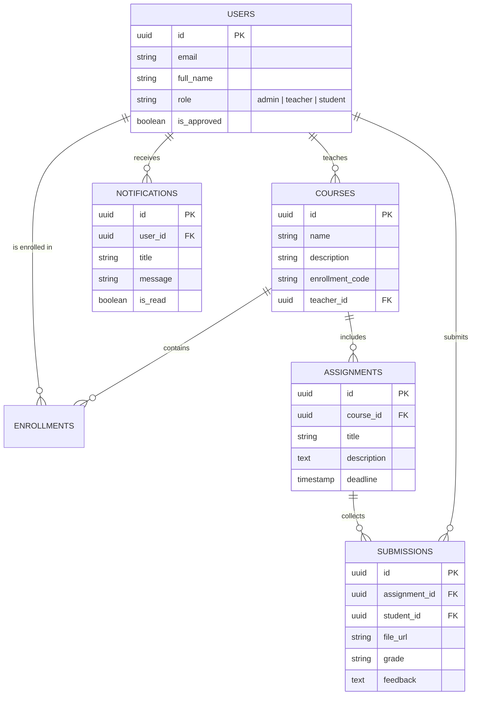
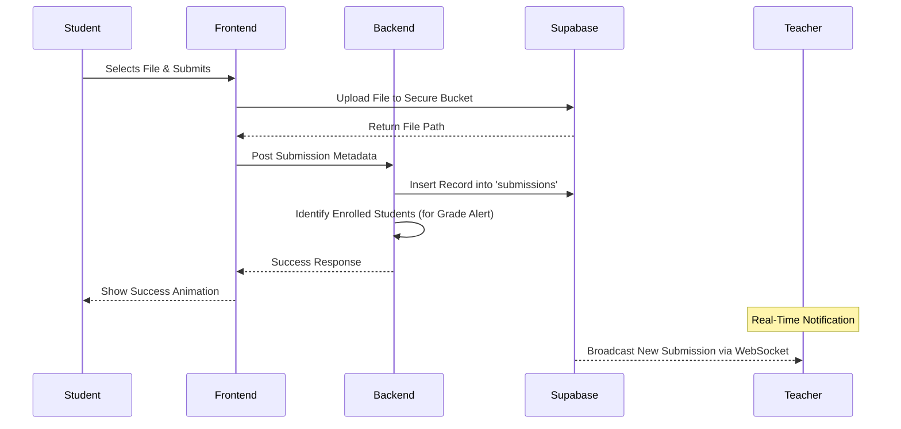
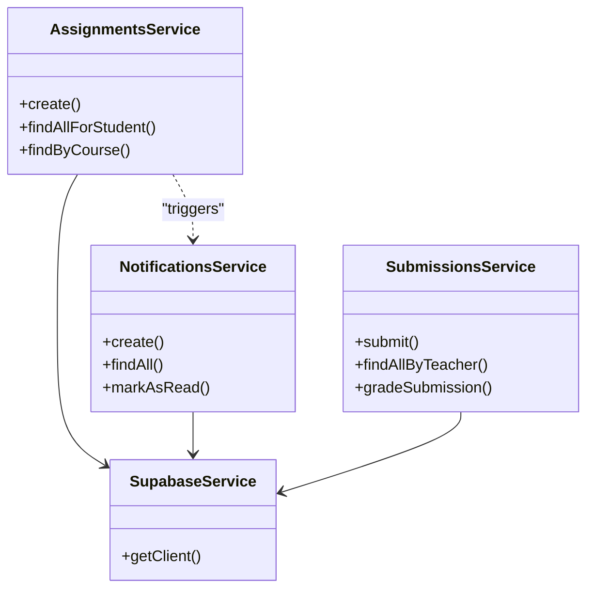
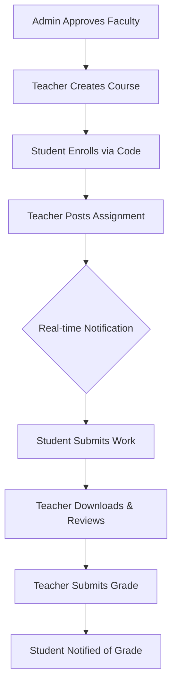
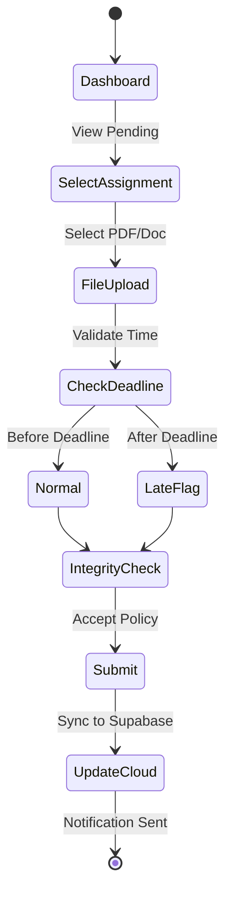

# 🏛️ Glacier EDU: The Institutional Monorepo

**Glacier EDU** is a premium, real-time academic management ecosystem designed for modern institutions. Built as a high-performance monorepo, it seamlessly bridges professors and students through secure submissions, live notifications, and a transparent grading matrix.

---

## 🛠️ Technology Stack
- **Frontend**: Next.js 15 (App Router), Tailwind CSS, Lucide Icons.
- **Backend**: NestJS (Node.js Framework), TypeScript.
- **Database**: Supabase (PostgreSQL) with Row Level Security (RLS).
- **Real-Time**: Supabase Realtime (WebSockets).
- **Storage**: Supabase Buckets (Secure Cloud Storage).
- **Infrastructure**: Docker & Docker Compose.

---

## 📊 System Architecture & Diagrams

### 1. Entity Relationship Diagram (ERD)
The relational backbone of the institutional cloud vault.



---

### 2. Use Case Diagram
Mapping the institutional roles and their capabilities.

```mermaid
useCaseDiagram
    actor Student
    actor Teacher
    actor Admin

    package "Glacier EDU Portal" {
        usecase "Enroll in Course" as UC1
        usecase "Submit Assignment" as UC2
        usecase "View Notifications" as UC3
        usecase "Download Submissions" as UC4
        usecase "Grade Work" as UC5
        usecase "Create Course" as UC6
        usecase "Approve Faculty" as UC7
    }

    Student --> UC1
    Student --> UC2
    Student --> UC3

    Teacher --> UC4
    Teacher --> UC5
    Teacher --> UC6
    Teacher --> UC3

    Admin --> UC7
    Admin --> UC6
```

---

### 3. Sequence Diagram: Assignment Submission Flow
The secure handshake between the student dashboard and the cloud storage.



---

### 4. Class Diagram (Backend Architecture)
Modularized NestJS structure for institutional scalability.



---

### 5. Flowchart: Academic Lifecycle
The chronological path from course creation to grading.



---

### 6. Activity Diagram: Student Submission Process
Detailed logic for handling deadlines and academic integrity.



---

## 🚀 Installation & Deployment

### Local Development
1. **Clone the repository**:
   ```bash
   git clone https://github.com/DarkMInato-bit/Edu-demia.git
   ```
2. **Install Dependencies**:
   ```bash
   npm install
   ```
3. **Configure Environment**:
   Create `.env` files in `apps/frontend` and `apps/backend` with your Supabase credentials.
4. **Run Locally**:
   ```bash
   npm run dev
   ```

### Docker Production
Deploy the institutional core using the provided orchestration blueprints:
```bash
cd infrastructure
docker-compose up --build
```

---

## 🏛️ Institutional Policies
- **Security**: All data is protected via Row Level Security (RLS).
- **Integrity**: Every submission requires a mandatory Academic Integrity confirmation.
- **Latency**: Real-time pulses ensure zero-delay communication between students and faculty.

---
**Glacier EDU** | *Elevating Institutional Excellence*
